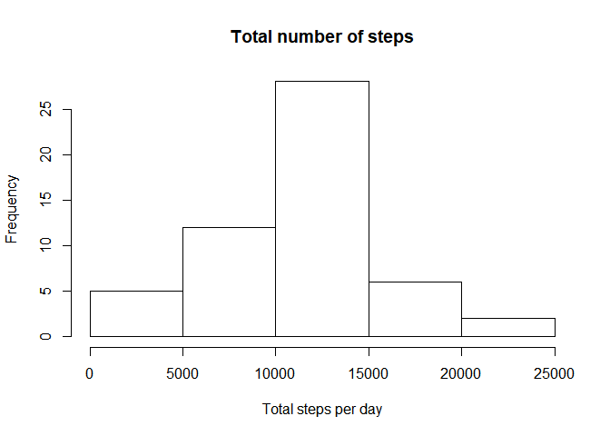
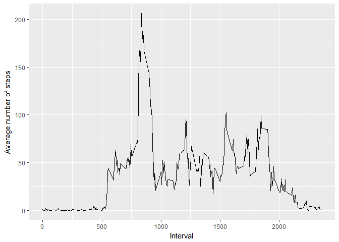
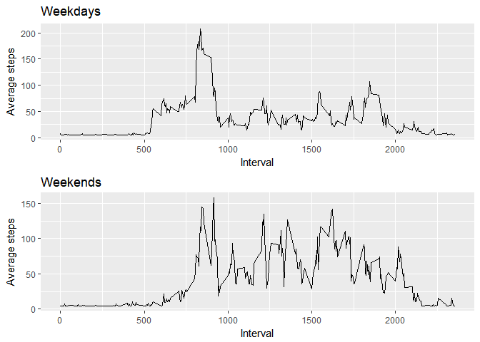

# My Project 1
Gabriela Rodriguez  
1 de septiembre de 2017  


In this first step we are going to load the data from activity.csv and we are going to clean it, quiting NA's and transforming date into "date format"


```r
library(readr)
activity <- read_csv("C:/Users/gabyr/Dropbox/Curso Data Science/activity.csv")
```

```
## Parsed with column specification:
## cols(
##   steps = col_integer(),
##   date = col_character(),
##   interval = col_integer()
## )
```

```r
d <- na.omit(activity)
d$date <- as.Date(d$date, format("%d/%m/%Y"))
```

## What is mean total number of steps taken per day

First, we are going to calculate the total number of steps taken per day using the function aggregate and make a histogram of the total


```r
f <- aggregate(d$steps, by=list(d$date), FUN=sum)
f$Group.1 <- as.Date(f$Group.1,  format("%d/%m/%Y"))
library(ggplot2)
total <- hist(f$x, main="Total number of steps", xlab= "Total steps per day")
```

<!-- -->


Now, we are going to calculate the mean and median total number of steps taken per day 
    
    ```r
    mean <- mean(f$x)
    print(" The mean is")    
    ```
    
    ```
    ## [1] " The mean is"
    ```
    
    ```r
    mean
    ```
    
    ```
    ## [1] 10766.19
    ```
    
    ```r
    median <- median(f$x)
    print("The median is")
    ```
    
    ```
    ## [1] "The median is"
    ```
    
    ```r
    median
    ```
    
    ```
    ## [1] 10765
    ```
## What is the average daily activity patern

In this question we are going to make a time series plot of the 5 minute interval and the average number of steps taken averaged across all days.


```r
meansperinterval <- aggregate(d$steps, by=list(d$interval), FUN=mean)
p2 <- ggplot(meansperinterval, aes(x=Group.1, y=x)) + geom_line(stat="identity") + labs(x= "Interval", y = "Average number of steps")
plot(p2)
```

<!-- -->

Now we are going to calculate which 5 minute interval, on average across all the days contains the maximun number of steps


```r
max <- which.max(meansperinterval[,2])
maxi <- meansperinterval[max,1]
print("The interval with the maximun number of steps is ")
```

```
## [1] "The interval with the maximun number of steps is "
```

```r
maxi
```

```
## [1] 835
```
##Imputing missing values 

In this section, we are going to find how many NA's are present and we are going to change them, NA's will take the mean of the number of steps on this particular day.


```r
NAs <- sum(is.na(activity))
print("The number of NA´s is")
```

```
## [1] "The number of NA´s is"
```

```r
NAs
```

```
## [1] 2304
```

Now, we are going to fill NA's wit the average number of steps of that day.
With this new dataset we are going to make a histogram of the total number of steps taken each day.


```r
activity[is.na(activity)]  <- mean(d$steps)
f1 <- aggregate(activity$steps, by=list(activity$date), FUN=sum)

f1$Group.1 <- as.Date(f1$Group.1,  format("%d/%m/%Y"))

total2 <- hist(f$x, main="Total number of steps", xlab= "Total steps per day")
```

<!-- -->
In this new dataset we are going to calculate the mean and the median 


```r
mean2<- mean(f1$x)
print(" The mean is")    
```

```
## [1] " The mean is"
```

```r
mean2
```

```
## [1] 10766.19
```

```r
median2 <- median(f1$x)
print("The median is")
```

```
## [1] "The median is"
```

```r
median2
```

```
## [1] 10766.19
```

So, it is posible to notice that values are different than the fist ones, indicating the importance of the substitution of NA's with known values. 

##Are there differences in activity patterns between weekdays and weekends

This will be done in two parts, in the first one we are going to create a new factor wit two levels "weekday" or "weekend". 
Then, we are going to make a plot containing a time series of the 5 minute interval averaged per interval per weekend or weekday

```r
weekdays1 <- c("lunes","lunes","martes","miércoles", "jueves", "viernes")
activity$wday <- c("weekend", "weekday")[(weekdays(as.Date(activity$date, format("%d/%m/%Y") )) %in% weekdays1)+1L]
library(ggplot2)
library(gridExtra)
library(plotly)

d1 <- subset(activity,wday == "weekday")
meansperinterval1 <- aggregate(d1$steps, by=list(d1$interval), FUN=mean)
g1 <- ggplot(meansperinterval1, aes(x=Group.1, y=x)) + geom_line(stat="identity") + labs(x= "Interval", y = "Average steps", title = "Weekdays")

d2 <- subset(activity,wday == "weekend")
meansperinterval2 <- aggregate(d2$steps, by=list(d2$interval), FUN=mean)
g2<- ggplot(meansperinterval2, aes(x=Group.1, y=x)) + geom_line(stat="identity") + labs(x= "Interval", y = "Average steps", title = "Weekends") + ggtitle("Weekends")
p4 <- grid.arrange(g1,g2, ncol=1, nrow=2)
```

<!-- -->


